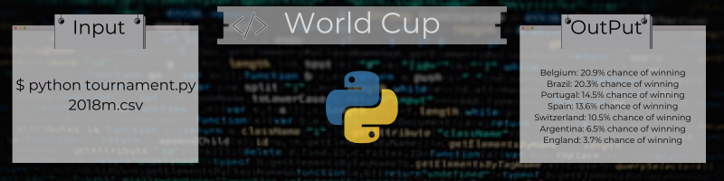
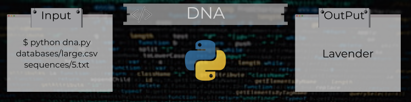
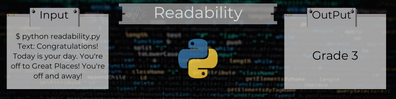
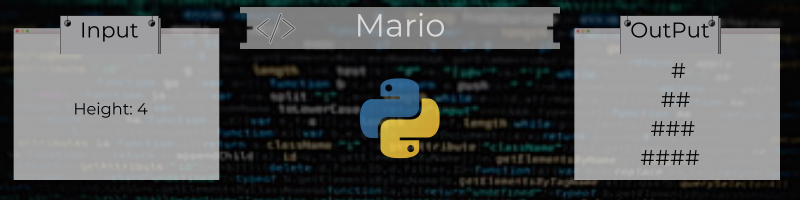
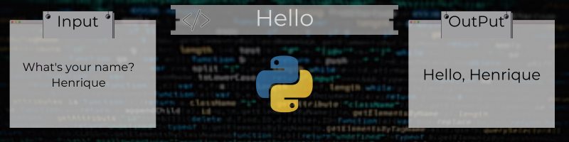

# cs50x-Python
Python: Functions, Arguments, Return Values; Variables; Boolean Expressions, Conditionals; Loops. Modules, Packages.

## Sixth Week Projects:

## Lab

### [World Cup](https://github.com/Henalecam/cs50x-Python/tree/main/world-cup)

The program we’ll write will be called **worldcup.py**. And it will **simulate a sports tournament**.

## Problems

### [DNA](https://github.com/Henalecam/cs50x-Python/tree/main/dna)

The program we’ll write will be called **dna.py**. And it will **identify a person based on their DNA**.

### [Readability](https://github.com/Henalecam/cs50x-Python/tree/main/sentimental-readability)

The program we’ll write will be called **readability.py**. And it will **compute the approximate grade level needed to comprehend some text**.

### [Cash](https://github.com/Henalecam/cs50x-Python/tree/main/sentimental-cash)

The program we’ll write will be called **cash.py**. And it will **calculate the minimum number of coins required to give a user change**.

### [Mario](https://github.com/Henalecam/cs50x-Python/tree/main/sentimental-mario)

The program we’ll write will be called **mario.py**. And it will **print out a double half-pyramid of a specified height**.

### [Hello](https://github.com/Henalecam/cs50x-Python/tree/main/sentimental-hello)

The program we’ll write will be called **hello.py**. And it will **print out a simple greeting to the user, per the below**.

